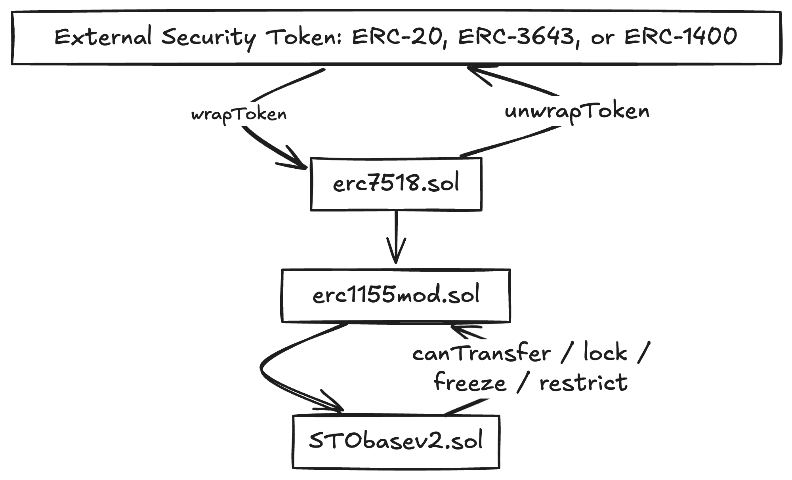
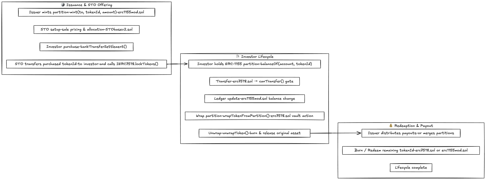

# ERC‑7518 (DyCIST) Reference Implementation


## Dynamic Compliant Interop Security Token

This repository contains the reference implementation for [ERC-7518](https://eips.ethereum.org/EIPS/eip-7518), a security token standard that extends ERC-1155 to provide a flexible framework for managing compliant real-asset security tokens.

## Overview

ERC-7518 introduces partitioned token management through the ERC-1155 multi-token paradigm, where each `tokenId` represents a distinct partition with its own set of rights, privileges, and compliance rules. This architecture enables management of tokenized real-world assets including fractional ownership, multiple share classes, and granular compliance controls. The standard also defines features like token locks, forced transfers, freezing, payouts, wrapping, and compliance hooks. ([eips.ethereum.org](https://eips.ethereum.org/EIPS/eip-7518))

### Key Concepts from the EIP

- **Partitions via `tokenId`**: Enables semi-fungible tokens with partition‑specific logic.  
- **Compliance Hooks**: Methods like `canTransfer`, `lockTokens`, `forceTransfer`, and `freeze` provide dynamic and enforceable rules.  
- **Payouts & Batch Payouts**: Built-in functions for token‑holder distributions.  
- **Interoperability**: Wrapping and unwrapping tokens, enabling cross‑chain or cross‑standard compatibility.  
- **Built on ERC‑1155 + ERC‑165**: Ensures backward compatibility and easy integration with wallets and dApps.  

## Partition Model at a Glance

ERC-7518 represents **partitions as ERC-1155 `id` or `tokenId`s**.  
Each `tokenId` corresponds to a **distinct partition** of a wrapped or regulated asset.  
All compliance checks, locks, and transfer rules are evaluated *per partition*.

| Concept | Description | Implemented In |
|----------|--------------|----------------|
| **Partition (`id`)** | Logical slice of an asset (e.g., restricted share class, lockup, compliance rule). | `erc1155mod.sol` |
| **Partition Balances** | Tracked under ERC-1155 balances: `balanceOf(account, partitionId)` | `erc1155mod.sol` |
| **Compliance Check** | Hook executed before every transfer to validate partition rule. | `erc7518.sol` (pre-transfer gate that calls `canTransfer`) |
| **Lock / Restrict** | Temporarily freezes partition transfers. | `erc7518.sol` |
| **Wrap / Unwrap** | Converts partitioned tokens ↔ fungible main balance. | `erc7518.sol` (`wrapToken`, `wrapTokenFromPartition`, `unwrapToken`) |
| **Force Transfer** | Admin-triggered override respecting partition metadata. | `erc7518.sol` |

`tokenId == partitionId`.  
Partitions can be **minted, merged, or wrapped** dynamically without redeploying the contract.

## Project Structure

```
erc‑7518‑foundry/
├── src/
│   ├── erc7518.sol            # Entry contract, vault and wrapper
│   ├── erc1155mod.sol         # ERC-1155 base ledger (partitions)
│   └── STObasev2.sol          # Security Token Offering contract
├── test/
│   └── ERC7518.t.sol          # Foundry tests
├── script/
│   └── Deploy.s.sol           # Deployment script
├── lib/                       # Dependencies (e.g., OZ contracts)
├── foundry.toml
├── README.md
└── LICENSE
```

## Contract Architecture and Flow

*Note:* `STObasev2` stands for **Security Token Offering**. It is scoped to offering setup and settlement only, not a generic compliance or freeze module.

The reference implementation has three main contracts that together realize the full ERC-7518 lifecycle.

| Contract | Role | Description |
|-----------|------|-------------|
| **erc1155mod.sol** | Base Ledger | Implements the ERC-1155 multi-token standard with minor optimizations. Each `tokenId` represents a distinct partition and holds balances, mint, burn, and transfer logic. |
| **STObasev2.sol** | Security Token Offering (STO) | Handles offering lifecycle and settlement. Manages sale inventory and pricing, settles purchases, and transfers purchased ERC‑1155 `tokenId` balances to investors. It does not implement global freezes or a generic transfer gate. |
| **erc7518.sol** | Vault and Wrapper | Acts as the entry point for ERC-7518. It handles wrapping and unwrapping of external security tokens (ERC-20, ERC-721, or partitioned ERC-1400), integrates the compliance layer, and delegates balance management to `erc1155mod.sol`. |

### High-Level Flow



### Detailed System Flow



### Partition Lifecycle (from mint to redemption)

1. **Mint**, issuer creates a partition by minting `tokenId` in `erc1155mod.sol`.
2. **STO settlement** (optional), `STObasev2.sol` settles a purchase and transfers the purchased `tokenId` to the investor.
3. **Transfer**, holder moves `tokenId` using `safeTransferFrom`, `erc7518.sol` calls the pre‑transfer gate (`canTransfer`) before updating balances.
4. **Wrap from partition**, holder calls `wrapTokenFromPartition(partitionId, tokenId, amount, data)`, `erc7518.sol` performs the vault action and mints the wrapped representation.
5. **Unwrap**, holder calls `unwrapToken(tokenId, amount, data)`, `erc7518.sol` burns wrapped balance and releases the original asset.
6. **Payout / Merge / Burn**, issuer optionally distributes payouts, merges partitions, or burns when the lifecycle ends.

### Code pointers

| Action | Where |
|---|---|
| Mint partition | `src/erc1155mod.sol` |
| Settle an STO purchase | `src/STObasev2.sol` |
| Pre‑transfer gate | `src/erc7518.sol` (`canTransfer` call) |
| Wrap from partition | `src/erc7518.sol` (`wrapTokenFromPartition`) |
| Unwrap | `src/erc7518.sol` (`unwrapToken`) |

## Core Features

### Partition Model and Management

- Each `tokenId` represents a unique partition with independent compliance rules
- Dynamic allocation of tokens between different classes or categories
- Support for temporary non-fungibility during regulatory holding periods
- Efficient management of complex asset structures within a single contract

### Compliance Framework
- `canTransfer()` - Pre-transfer compliance validation
- `restrictTransfer()` / `removeRestriction()` - Dynamic transfer restrictions per partition
- `freezeAddress()` / `unFreeze()` - Account-level compliance actions
- Off-chain voucher support for dynamic compliance verification

### Token Locking
- `lockTokens()` - Time-based token vesting and holding periods
- `unlockToken()` - Automated release after lock expiry
- `transferableBalance()` - Query available balance excluding locked tokens
- `lockedBalanceOf()` - Query locked token amounts

### Recovery Mechanisms
- `forceTransfer()` - Authorized recovery for lost keys or compliance violations
- Bypass standard transfer restrictions for regulatory enforcement

### Payout Distribution
- `payout()` - Single recipient distributions
- `batchPayout()` - Efficient multi-recipient payouts in single transaction

### Interoperability
- `wrapToken()` / `unwrapToken()` - ERC-20 token wrapping
- Full backward compatibility with ERC-1155


##  Getting Started

### Prerequisites

- [Foundry](https://book.getfoundry.sh/) installed (`forge`, `cast`).
- Solidity ≥ 0.8.x.
- 
## Deployment

```bash
# Install dependencies
forge install

# Build contracts
forge build

# Run tests
forge test -vvv

# Run gas snapshot
forge snapshot

# Deploy to network
forge script script/Deploy.s.sol --rpc-url <RPC_URL> --broadcast --verify
```

## Testing

```bash
# Run all tests with verbosity
forge test -vvv

# Run specific test file
forge test --match-path test/ERC7518.t.sol

# Gas report
forge test --gas-report
```

##  Example Use Cases

- **Fractional real estate classes**: Define separate tranches (e.g., common vs. preferred) as partitions.
- **Tranche-based finance**: Different risk/return tiers represented by partition-specific token IDs.
- **Cross-chain compliant RWAs**: Tokens retain compliance state while moving across chains.

## Guide

1. **Implement compliance logic**: Add `canTransfer(...)` checks using off-chain vouchers or on-chain registries.
2. **Add recovery and lock features**: Support token recovery via `forceTransfer`, and vesting via `lockTokens`.
3. **Support freezing**: Allow `freeze()` and `unfreeze()` on accounts or partitions.
4. **Enable payouts**: Safely distribute payouts using `payout()` and `batchPayout()`.
5. **Incorporate interoperability**: Use `wrapToken()` and `unwrapToken()` for cross-chain or cross-standard compatibility.
6. **Audit, document, license**: Add comments, documentation, and choose a suitable open-source license (e.g., MIT).

## License

This project is released under the **GPL-3.0 License**.

## References

- [EIP-7518 Specification](https://eips.ethereum.org/EIPS/eip-7518)
- [ERC-1155 Multi-Token Standard](https://eips.ethereum.org/EIPS/eip-1155)
- [ERC-165 Standard Interface Detection](https://eips.ethereum.org/EIPS/eip-165)


Maintained by [Zoniqx](https://zoniqx.com)